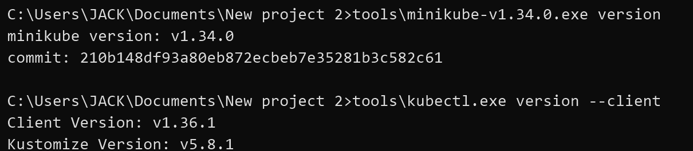
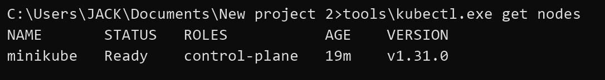
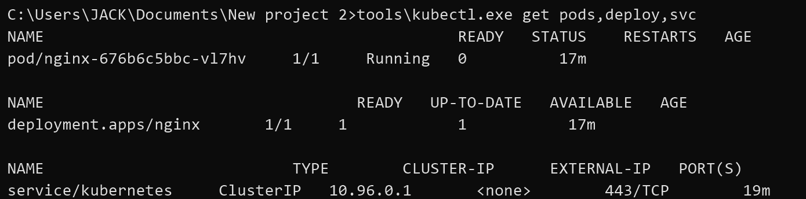
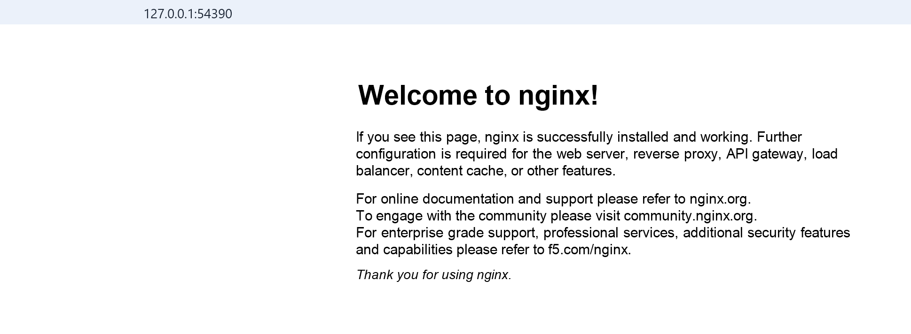

# Minikube 部署 Nginx 实验报告

## 1. 实验目标

在本地使用 Minikube 搭建 Kubernetes 环境，通过 `kubectl` 部署一个 Nginx 应用，并使用 NodePort Service 暴露服务，最后通过浏览器验证 Nginx 可以正常访问。

## 2. 实验环境

- 操作系统：Windows
- 容器运行环境：Docker Desktop
- Kubernetes 环境：Minikube
- Kubernetes 命令行工具：kubectl
- 应用镜像：`nginx`

## 3. K3s/minikube 安装证明

本次实验选择使用 Minikube，不使用 K3s。

Minikube 和 kubectl 版本截图：



集群节点状态截图：



验证命令：

```cmd
tools\minikube-v1.34.0.exe version
tools\kubectl.exe version --client
tools\kubectl.exe get nodes
```

关键输出：

```text
minikube version: v1.34.0
Client Version: v1.36.1

NAME       STATUS   ROLES           AGE   VERSION
minikube   Ready    control-plane   19m   v1.31.0
```

说明 Minikube 已成功安装并启动，本地 Kubernetes 集群节点处于 `Ready` 状态。

## 4. Nginx 部署步骤

创建 Nginx Deployment：

```cmd
tools\kubectl.exe create deployment nginx --image=nginx
```

输出：

```text
deployment.apps/nginx created
```

暴露 Nginx Service：

```cmd
tools\kubectl.exe expose deployment nginx --port=80 --type=NodePort
```

输出：

```text
service/nginx exposed
```

## 5. kubectl get pods 输出

Pod、Deployment 和 Service 状态截图：



查看状态命令：

```cmd
tools\kubectl.exe get pods,deploy,svc
```

输出：

```text
NAME                         READY   STATUS    RESTARTS   AGE
pod/nginx-676b6c5bbc-vl7hv   1/1     Running   0          17m

NAME                    READY   UP-TO-DATE   AVAILABLE   AGE
deployment.apps/nginx   1/1     1            1           17m

NAME                 TYPE        CLUSTER-IP      EXTERNAL-IP   PORT(S)        AGE
service/kubernetes   ClusterIP   10.96.0.1       <none>        443/TCP        19m
service/nginx        NodePort    10.100.97.165   <none>        80:32287/TCP   17m
```

从结果可以看到：

- Nginx Pod 状态为 `Running`
- Deployment 可用副本为 `1/1`
- Nginx Service 类型为 `NodePort`

## 6. Nginx 访问成功截图

获取 Nginx 服务访问地址：

```cmd
tools\minikube-v1.34.0.exe service nginx --url
```

输出：

```text
http://127.0.0.1:54390
```

浏览器访问结果：



页面显示：

```text
Welcome to nginx!
```

说明 Nginx 服务已经成功暴露，并且可以通过浏览器访问。

## 7. 实验结果

本次实验成功完成了 Minikube 本地 Kubernetes 集群的启动、Nginx Deployment 的创建、NodePort Service 的暴露以及浏览器访问验证。

最终结果如下：

- Minikube 节点状态为 `Ready`
- Nginx Pod 状态为 `Running`
- Nginx Deployment 状态为 `1/1`
- Nginx Service 类型为 `NodePort`
- 浏览器成功访问 Nginx 默认欢迎页

## 8. 概念理解

- Pod：Kubernetes 中最小的部署单元，本实验中的 Nginx 容器运行在 Pod 中。
- Deployment：用于管理 Pod 的期望状态，保证 Nginx 副本正常运行。
- Service：为 Pod 提供稳定访问入口，本实验使用 `NodePort` 类型将 Nginx 暴露到本地浏览器访问。
