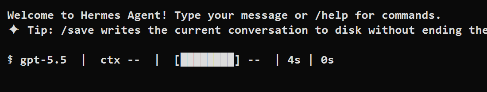
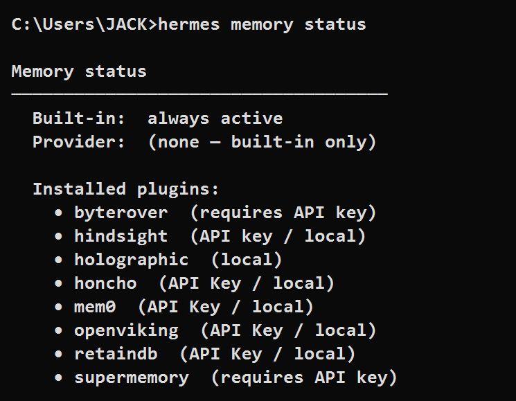
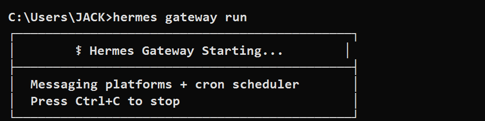

# Hermes CLI 对话 Agent 实验

## 实验目标

本实验完成 Hermes CLI 的安装与基础使用验证，创建一个简单的中文对话 Agent，并观察 Hermes 的记忆功能和持续运行机制。

## 环境信息

- 操作系统：Windows
- 终端：PowerShell / CMD
- Hermes CLI：Hermes Agent v0.14.0
- 模型配置：OpenAI Codex / OpenAI 账号已完成登录配置

## 实验步骤

### 1. 安装 Hermes CLI

使用 Hermes 官方安装脚本安装 CLI：

```powershell
irm https://raw.githubusercontent.com/NousResearch/hermes-agent/main/scripts/install.ps1 | iex
```

安装后验证版本：

```powershell
hermes --version
```

### 2. 配置模型

运行模型配置命令：

```powershell
hermes model
```

在 provider 选择界面中选择 OpenAI Codex，并按照提示完成登录。

### 3. 启动简单对话 Agent

使用 Hermes 启动对话：

```powershell
hermes
```

或使用单轮命令测试 Agent 是否可以正常回复：

```powershell
hermes chat -q "你是一个简单的中文对话Agent。请回复：Agent已启动，可以正常对话。然后问我一个问题。" --quiet
```

Agent 启动界面如下：



### 4. 观察记忆功能

运行：

```powershell
hermes memory status
```

输出显示 Hermes 内置记忆功能始终启用：

```text
Memory status
────────────────────────────────────────
  Built-in:  always active
  Provider:  (none — built-in only)

  Installed plugins:
    • byterover  (requires API key)
    • hindsight  (API key / local)
    • holographic  (local)
    • honcho  (API Key / local)
    • mem0  (API Key / local)
    • openviking  (API Key / local)
    • retaindb  (API Key / local)
    • supermemory  (requires API key)
```

截图如下：



说明：`Built-in: always active` 表示 Hermes 内置记忆功能已启用；当前没有额外配置外部 memory provider。

### 5. 观察持续运行机制

运行：

```powershell
hermes gateway run
```

输出显示 Gateway 进入前台常驻运行模式：

```text
Hermes Gateway Starting...
Messaging platforms + cron scheduler
Press Ctrl+C to stop
```

截图如下：



说明：Gateway 是 Hermes 的持续运行入口，用于承载消息平台和 cron scheduler。当前未配置 Telegram、Discord、Slack 等消息平台，因此会提示没有启用 messaging platforms，但常驻机制已经启动。

## 实验结论

1. Hermes CLI 已成功安装并完成模型配置。
2. Hermes 可以启动简单的中文对话 Agent。
3. `hermes memory status` 显示内置记忆功能始终启用。
4. `hermes gateway run` 可以启动前台常驻进程，体现 Hermes 的持续运行机制。

## 提交内容

- `README.md`：实验说明、命令、结果与截图整理
- `screenshots/hermes-agent-start.png`：Agent 启动截图
- `screenshots/hermes-memory-status.png`：记忆功能截图
- `screenshots/hermes-gateway-run.png`：Gateway 持续运行截图
